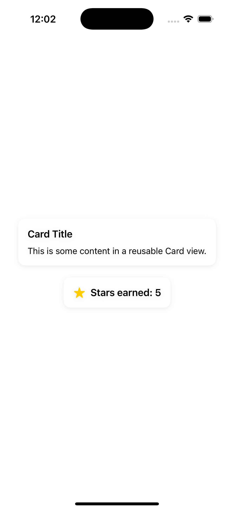

# 02 - Reusable Card View Component

## Introduction

The second component of my series is a reusable `Card` view. It's still very simple, but its inner workings lay down the foundation on which frameworks like `SwiftUICharts`, or `SwiftUI Essentials` are built.

You may ask yourself why a `Card` view?

That's my personal opinion, but it's one of those views that many developers find themselves using the most, since it immediately gives out the idea of a _container_. What's important to take away is the idea of a container, and you might have called your component something else.

A `Card` view is nothing but a container for UI content that:

- Groups UI elements together (e.g., a section of a form, a news article).

- Has a background, rounded corners, and a shadow.

- May be reused in many contexts (e.g., lists, detail views, dashboard layouts).

## Component Description

Let me walk you through some of the `Card` view component code.

First off, we have the line defining the `Card` struct itself: `public struct Card<Content: View>: View`.

Well, this is a **generic** struct — its code works with any type, as long as that type conforms to the `View` protocol. `Content` in `<Content: View>` is just a type parameter name, which also specifies the constraints — conformance to the `View` protocol. Also, `Card` itself conforms to the `View` protocol, which makes it a type of `View` as well. That also means that it can be rendered in SwiftUI, very similar to `Text` or `VStack` in SwiftUI.

Next up, 
